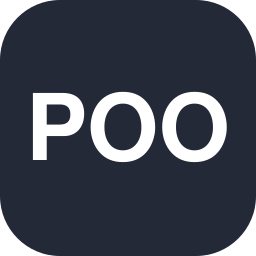

<div align="center">


<br><br>


</div>

---

## About me

Hi, I'm **Daniel**.

I'm getting ready to start a **Computer Science** degree, studying beforehand so I arrive with a solid foundation. I'm an aspiring **Data Engineer**, focused on building reliable data pipelines.

**Current focus:**

- 🐍 Python: object-oriented programming (inheritance, abstraction, classes)
- 🗄️ SQL: queries, aggregations, JOINs and modeling, using SQLite
- 📊 Data: learning to extract and organize information from databases, the foundation for future ETL/ELT pipelines
- 🔀 Version control with Git and GitHub

### Goal

I want to specialize in data engineering, aiming for professional growth and a solid foundation in **Python**, **SQL/PostgreSQL**, **APIs**, **ETL/ELT** pipelines and tools like **Airflow** and **Docker**. Right now, I'm strengthening my knowledge.

---

## Technologies

<div align="center">

**Languages**




**Databases**


**Development**


</div>

---

## My stack

<table>
<tr>
<td width="50%" valign="top">

### Programming

```
Python      ███████░░░  experience
OOP         ██████████  completed
Git/GitHub  ██████░░░░  experience
APIs        ░░░░░░░░░░  coming soon
```

</td>
<td width="50%" valign="top">

### Data

```
SQL         ███░░░░░░░  experience
PostgreSQL  ░░░░░░░░░░  coming soon
Pandas      ░░░░░░░░░░  coming soon
```

</td>
</tr>
</table>

### Next steps


`ETL / ELT` · `Data pipelines` · `Docker` · `Airflow`

---

## Projects

<div align="center">
<i>Some of the projects that represent my learning journey.</i>
</div>

<br>

<table>
<tr>
<td width="50%" valign="top">

### Turn-Based RPG
`Python` `OOP`

A turn-based RPG game for the terminal, built with object-oriented programming: `Personagem`, `Guerreiro` and `Mago` classes (character, warrior and mage), inheritance, an abstract class and a turn system. The interface uses panels and tables from the `rich` library.

[View code →](https://github.com/d-almeidas/Python-Poo-studies/blob/main/Poo-Exercices/RPG!!!!!!.py)

</td>
<td width="50%" valign="top">

### Python OOP Studies
`Python` `OOP`

Object-oriented programming exercises covering inheritance, abstraction and classes.

[View repository →](https://github.com/d-almeidas/Python-Poo-studies)

</td>
</tr>
<tr>
<td colspan="2" valign="top">

### Next project
`Work in progress`

My first project using a database will go here. Stay tuned!

</td>
</tr>
</table>

---

## Contribution garden

<div align="center">


</div>

---

## Let's talk?

<div align="center">

<!-- LinkedIn: add here when the account is created -->
[](https://www.instagram.com/d.aires._)
[](mailto:neaa01111@gmail.com)
[](https://github.com/d-almeidas)

<br>

`Python` · `SQL` · `Data` · `Continuous learning`


</div>
