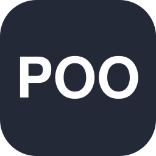

<div align="center">


<br><br>


</div>

---

## Sobre mim

Olá, eu sou o **Daniel**.

Estou me preparando para começar a faculdade de **Ciência da Computação**, estudando antes para chegar com uma boa bagagem. Sou aspirante a **Engenheiro de Dados**, focado em construir pipelines de dados confiáveis.

**Meu foco atual:**

- 🐍 Python: programação orientada a objetos (herança, abstração, classes)
- 🗄️ SQL: consultas, agregações, JOINs e modelagem, usando SQLite
- 📊 Dados: aprendendo a extrair e organizar informações de bancos de dados, a base para futuros pipelines de ETL/ELT
- 🔀 Controle de versão com Git e GitHub

### Objetivo

Quero me especializar em engenharia de dados, buscando crescimento profissional e uma base sólida em **Python**, **SQL/PostgreSQL**, **APIs**, pipelines de **ETL/ELT** e ferramentas como **Airflow** e **Docker**. No momento, estou reforçando meus conhecimentos.

---

## Tecnologias

<div align="center">

**Linguagens**




**Bancos de dados**


**Desenvolvimento**


</div>

---

## Meu stack

<table>
<tr>
<td width="50%" valign="top">

### Programação

```
Python      ███████░░░  experiência
POO         ██████████  concluído
Git/GitHub  ██████░░░░  experiência
APIs        ░░░░░░░░░░  em breve
```

</td>
<td width="50%" valign="top">

### Dados

```
SQLite      ██████████  concluído
PostgreSQL  ██████░░░░  experiência
Pandas      ░░░░░░░░░░  em breve
```

</td>
</tr>
</table>

### Próximos passos


`ETL / ELT` · `Pipelines de dados` · `Docker` · `Airflow`

---

## Projetos

<div align="center">
<i>Alguns dos projetos que representam minha jornada de aprendizado.</i>
</div>

<br>

<table>
<tr>
<td width="50%" valign="top">

### RPG por Turnos
`Python` `POO`

Um jogo de RPG por turnos para o terminal, feito com programação orientada a objetos: classes `Personagem`, `Guerreiro` e `Mago`, herança, uma classe abstrata e um sistema de turnos. A interface usa painéis e tabelas da biblioteca `rich`.

[Ver código →](https://github.com/d-almeidas/Python-Poo-studies/blob/main/Poo-Exercices/RPG!!!!!!.py)

</td>
<td width="50%" valign="top">

### Feature Store de Perfil Comportamental de Clientes
`SQL` `Python`

Uma tabela de perfil comportamental de clientes construída em SQLite: CTEs, window functions e agregação condicional para calcular volume de transações, saldo de pontos, produto mais usado, e dia da semana/período do dia mais ativos em múltiplas janelas de tempo (7/14/28/56 dias), além de um indicador de engajamento recente versus histórico.

[Ver código →](https://github.com/d-almeidas/SQL---Studies/blob/main/exercicos/Projeto/Projeto.sql)

</td>
</tr>
</table>

---

## Jardim de contribuições

<div align="center">


</div>

---

## Vamos conversar?

<div align="center">

<!-- LinkedIn: adicionar aqui quando a conta for criada -->
[](https://www.instagram.com/d.aires._)
[](mailto:neaa01111@gmail.com)
[](https://github.com/d-almeidas)

<br>

`Python` · `SQL` · `Dados` · `Aprendizado contínuo`


</div>
